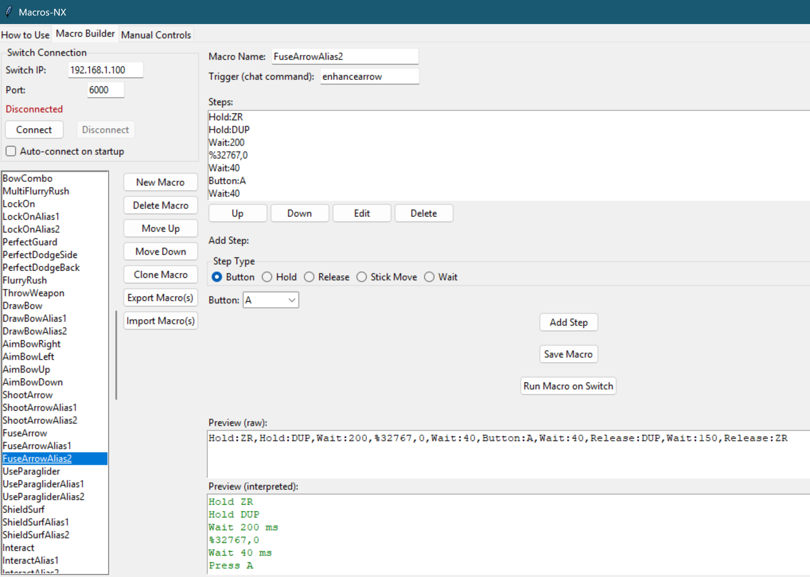

# Macros-NX: Macro Builder for Nintendo Switch

## Overview

**Macros-NX** is a Python-based GUI tool for building, editing, and running controller macros on a Nintendo Switch via [sys-botbase](https://github.com/olliz0r/sys-botbase). It allows you to automate button presses, stick movements, and complex input sequences

- **Screenshot:**
  

---

## Features

- Visual macro builder with drag-and-drop step editing
- Support for all Switch buttons and both sticks
- Macro import/export (JSON)
- Manual controls for real-time input
- Step types: Button, Hold, Release, Stick Move, Wait
- Stick grid for precise analog input
- Macro preview (raw and interpreted)
- Save/load macros and configuration
- Robust error handling and user feedback
- Auto-connect to Switch on startup

## Setup & Installation

1. **Install Python 3.7+**
   - If using rye: `rye sync`
   - If using pip: `pip install -r requirements.txt` (if present)
3. **Install sys-botbase on your Switch:**
   - Download from [sys-botbase GitHub](https://github.com/olliz0r/sys-botbase)
   - Extract to your Switch SD card and reboot
4. **Run the app:**
   - `python macroBuilder.py`
   - Or use `open_macroBuilder.bat` on Windows

---

## Usage

1. **Connect to your Switch:**
   - Enter your Switch's IP and port (default: 6000)
   - Click `Connect`
2. **Build or import a macro:**
   - Use the Macro Builder tab to add/edit steps
   - Import/export macros as JSON
3. **Test macros:**
   - Use `Run Macro on Switch` to send the macro live
4. **Manual controls:**
   - Use the Manual Controls tab for real-time input

See the in-app "How to Use" tab for detailed instructions and troubleshooting.

---

## Share your macros!

Have a cool set of macros you made? Please consider sharing them so that I can include them within the repo within the Macros folder